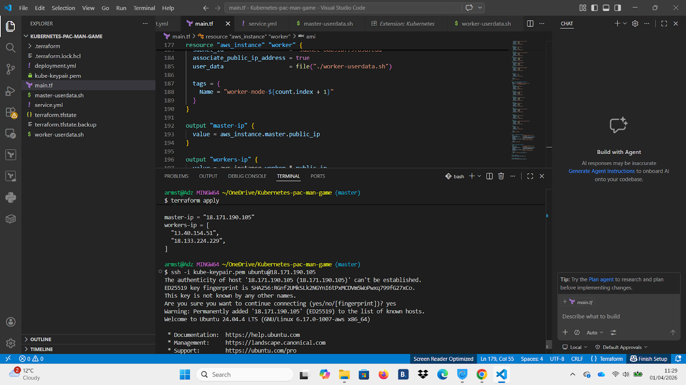
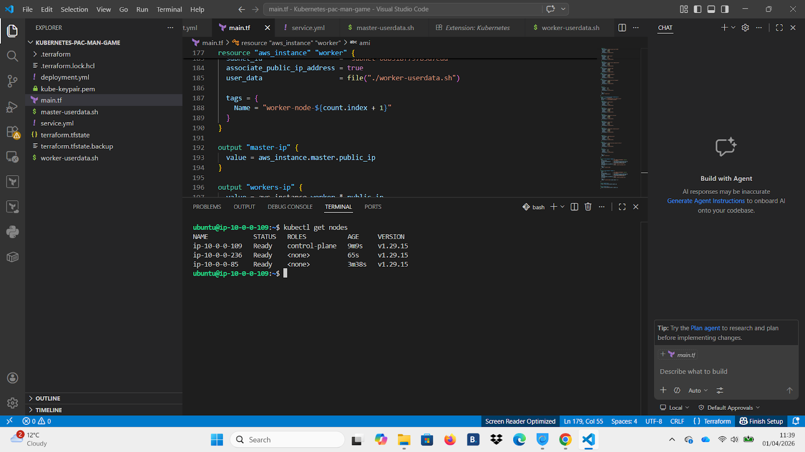
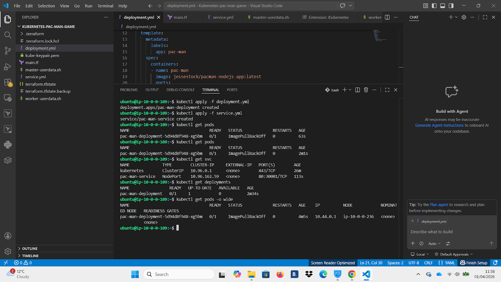
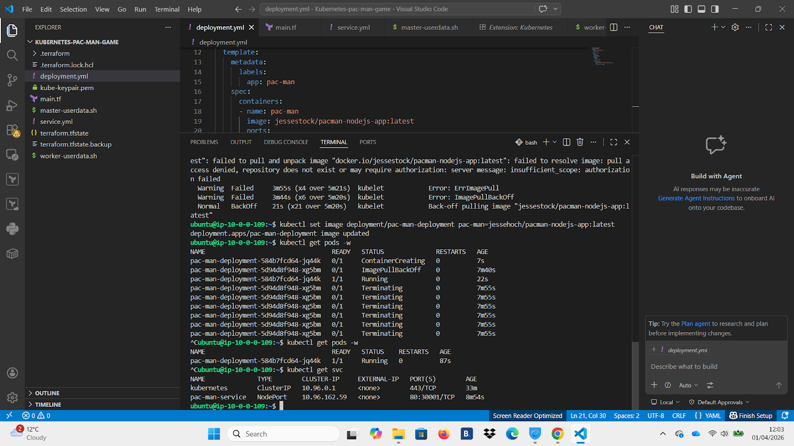
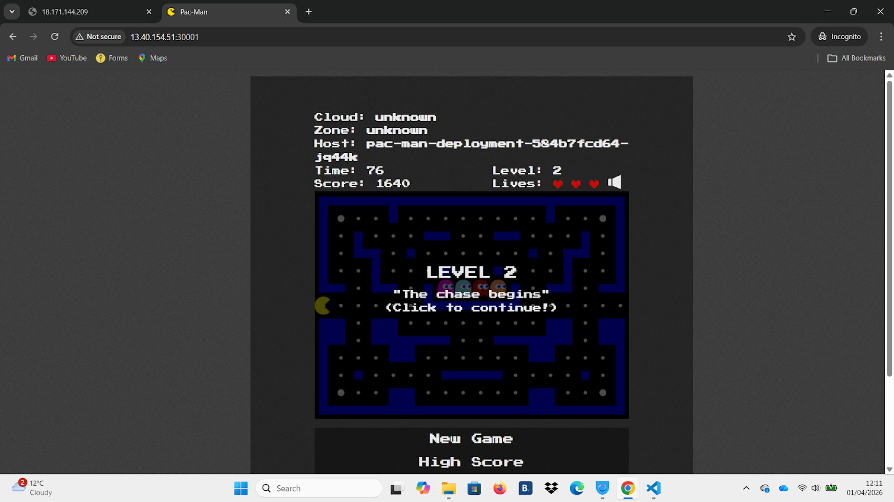

# Kubernetes Pacman Lab

This project provisions AWS infrastructure using Terraform, sets up a Kubernetes cluster using kubeadm, and deploys a containerised Pacman application accessible via a public NodePort.

---

## Overview

- Infrastructure provisioned using Terraform  
- Kubernetes cluster configured with kubeadm  
- Multi-node setup (1 master, multiple workers)  
- Pacman application deployed using Kubernetes  
- Application exposed via NodePort and accessed via browser  

---

## Technologies

- Terraform  
- AWS EC2  
- Kubernetes (kubeadm)  
- Docker  
- Linux (Ubuntu)  

---

## Deployment

### Terraform Infrastructure


---

### Kubernetes Cluster


---

### Application Deployment


---

### Service Exposure


---

### Application Running


---

## Commands

```bash
terraform init
terraform apply

ssh -i kube-keypair.pem ubuntu@<master-ip>

kubectl get nodes
kubectl apply -f deployment.yml
kubectl apply -f service.yml
kubectl get pods
kubectl get svc
Access

http://<worker-ip>:30001

Source

https://hub.docker.com/r/jessestchok/pacman-nodejs-app

Author

Armstrong Lawal
BSc (Hons) Computing Graduate
Aspiring DevOps Engineer